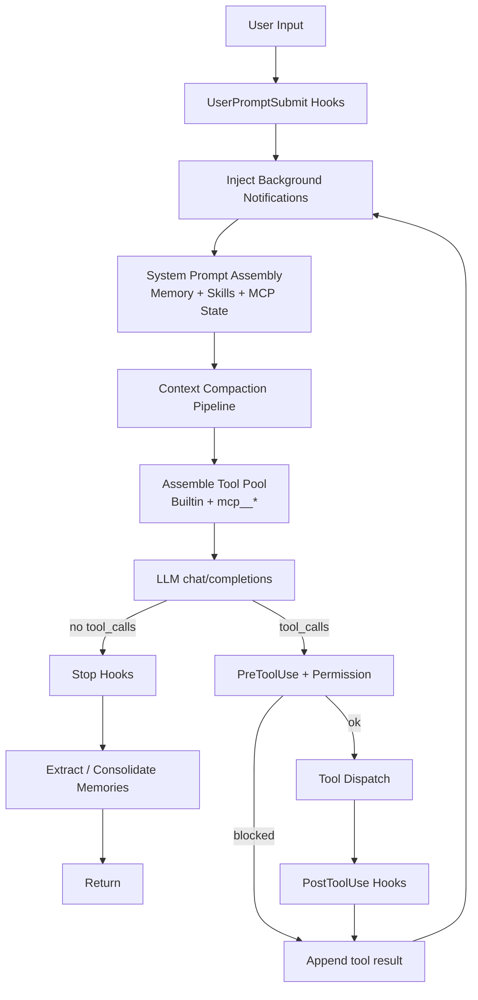

# Tiny-Claude-Code

[](https://www.python.org/)
[](https://platform.openai.com/docs/api-reference)
[](#license)
[](evals/SUMMARY.md)

**纯原生 Python 实现的轻量级 Coding Agent Harness**：不依赖 LangChain / LlamaIndex 等编排框架，将工具分发、权限 Hooks、上下文压缩、长期记忆、持久化任务图、后台并发与 MCP 动态工具，统一挂在**同一个主循环**上。

> 设计重心是 **运行时集成点**——何时注入上下文、何时拦截工具、结果如何回到 `messages`——而不是链式 DSL。

**技术栈：** Python 3.10+ · `requests` · OpenAI-Compatible Chat Completions · 多线程后台执行 · JSON / Markdown 落盘

---

## Architecture Overview

主循环入口：`agent/core/loop.py`。



ASCII 简图：

```text
User Input
  → UserPromptSubmit hooks
  → background task_notification 注入
  → System Prompt 组装（记忆 / 技能目录 / MCP 状态）
  → Compaction（大输出落盘 → 剪历史 → 旧结果占位 → 必要时摘要）
  → assemble_tool_pool → LLM
  → 无 tool_calls？ → Stop → 记忆提取/整合 → 结束
  → 有 tool_calls？ → PreToolUse / 权限
        → 同步工具 | 后台 bash 占位 | MCP handler
        → PostToolUse → tool 结果回 messages → 下一轮
```

**工程取舍（刻意不做）：** cron 调度、多 Agent 团队总线、Git Worktree 沙箱。复杂度收拢在「可讲清、可回归」的统一 Harness，便于调优与面试阐述。

---

## Key Features

### 1. 统一主循环与 Hook 管线

- **单一编排入口**：所有能力挂在同一 `while True`，避免「多套循环各跑各的」。
- **生命周期 Hooks**：`UserPromptSubmit` / `PreToolUse` / `PostToolUse` / `Stop`。
- **权限策略**：危险命令黑名单硬拦、可疑操作与越界路径交互确认、MCP 主机侧 `allow` / `confirm`（授权不来自服务器自述）。

### 2. 分层上下文压缩与身份保护

- **大工具输出落盘**，对话里只留预览与路径。
- **剪裁中间消息 + 旧 tool 结果占位**，控制上下文体积。
- **超限 LLM 摘要 / reactive compact**；每轮重建 system，保留工作约定、记忆与 MCP 状态，避免「压没人设」。

### 3. 持久化 Task DAG 与后台并发

- **双层规划**：会话内 `todo_write` + 可依赖、可认领的持久化任务图（`create` → `blockedBy` → `claim` → `complete`）。
- **任务落盘**：`agent/.runtime/tasks/task_*.json`，支持环检测与依赖门禁。
- **后台 bash**：`run_in_background=true` 时线程 + 子进程执行，主循环立即返回占位；完成后以 `<task_notification>` 回灌。

### 4. SubAgent 上下文隔离与 MCP 动态扩展

- **`task` SubAgent**：独立 `messages` + 基础工具子集，只向父 Agent 返回最终摘要（上下文隔离，非 Git Worktree）。
- **MCP（进程内 mock）**：`connect_mcp` 后动态注册 `mcp__server__tool`，与内置工具共用分发与权限链路。

### 5. 量化回归（Harness 断言集）

自建 **A–F 六维**评测（工具 / 权限 / 任务图 / 后台 / MCP / 多步上下文）：

| 模式 | 结果 | Token |
|------|------|------:|
| Offline（0 API） | **17/17** | 0 |
| Online（qwen3.7-plus） | **31/31** | ≈ 33.1 万 |
| **合计** | **48/48** | ≈ 33.1 万 |

定位为 **Harness 控制流与边界的集成断言**，而非 SWE-bench / MBPP 榜单。详见 [`evals/`](evals/) 与 [`evals/SUMMARY.md`](evals/SUMMARY.md)。

---

## Project Structure

```text
Tiny-Claude-Code/
├── agent/                      # 运行时包（纯原生 Python）
│   ├── main.py                 # CLI 入口
│   ├── config.py               # API_KEY / BASE_URL / MODEL_NAME / 路径
│   ├── core/
│   │   ├── loop.py             # ★ Harness 主循环
│   │   ├── execute.py          # PreToolUse → 分发（含后台）→ PostToolUse
│   │   └── llm.py              # OpenAI 兼容 chat/completions
│   ├── tools/                  # 工具 schema + handlers
│   ├── hooks/                  # 生命周期与权限
│   ├── compaction/             # 上下文压缩管线
│   ├── memory/                 # 长期记忆召回 / 提取 / 整合
│   ├── skill_load/             # Skills 扫描与系统提示拼装
│   ├── tasks/                  # 持久化任务 DAG
│   ├── background/             # 后台 bash 管理器
│   ├── mcp/                    # MCP 连接、策略、动态工具池
│   └── .runtime/               # 运行时落盘（gitignore）
├── skills/                     # 技能文档 SKILL.md
├── evals/                      # 离线 + 在线评测
│   ├── runner.py
│   ├── cases/                  # A–F 用例
│   └── reports/                # 评测报告
└── README.md
```

---

## Quick Start

### 环境

- Python **3.10+**（推荐 3.11 / 3.12）
- 依赖：

```bash
pip install requests python-dotenv PyYAML
```

### 配置

在 `agent/.env` 写入（已被 gitignore）：

```env
API_KEY=你的密钥
BASE_URL=https://你的兼容端点/compatible-mode/v1
MODEL_NAME=你的模型名
```

请求地址为：`{BASE_URL}/chat/completions`。

> 工作目录 `WORKDIR` 取进程启动时的 `cwd`，请在**仓库根目录**启动，以便正确扫描 `skills/` 并做路径沙箱。

### 运行

```bash
cd Tiny-Claude-Code
python -m agent.main
```

- 输入任务后回车发送  
- 输入 `exit` 或空行退出  
- `Ctrl+C` 中断  

### 跑评测

```bash
# 零成本：权限 / 任务图 / 后台 / MCP 池
python -m evals.runner --mode offline

# 在线场景（注意 API 额度）
python -m evals.runner --mode online --skip-f --token-budget 120000
```

---

## Built-in Tools & Capabilities

### 父 Agent 内置工具（15+）

| 类别 | 工具 | 说明 |
|------|------|------|
| 文件系统 | `read` / `write` / `edit` / `glob` | 工作区内读写与检索（`safe_path`） |
| Shell | `bash` | 本地命令；可选 `run_in_background` |
| 会话规划 | `todo_write` | 覆盖式待办，同时至多一个 `in_progress` |
| 任务图 | `create_task` / `update_task` / `list_tasks` / `get_task` / `claim_task` / `complete_task` | 持久化依赖图 |
| 委派 | `task` | SubAgent，仅返回摘要 |
| 技能 | `load_skill` | 按名加载 `skills/*/SKILL.md` |
| MCP | `connect_mcp` | 连接 mock 服务器并发现工具 |

### MCP Mock（连接后动态出现）

| 服务器 | 工具名 | 主机策略 |
|--------|--------|----------|
| `docs` | `mcp__docs__search` / `mcp__docs__get_version` | allow |
| `deploy` | `mcp__deploy__status` | allow |
| `deploy` | `mcp__deploy__trigger` | confirm（需用户确认） |

### SubAgent 能力边界

- 独立对话与基础工具（`bash` / `read` / `write` / `edit` / `glob`）
- **不包含** `task` / `todo_write` / 任务图 / `connect_mcp`（避免套娃）

---

## 长期记忆（简要）

落盘目录：`agent/.runtime/memory/`（Markdown + `MEMORY.md` 索引）。

```text
每轮开始 → 召回相关记忆 → 写入 system
正常结束 → 提取 persistent 记忆 → 条数过多则 LLM 整合
```

类型示例：`user` / `feedback` / `project` / `reference`。

---

## 权限与安全说明

- **硬拦**：如 `sudo`、`shutdown`、`rm -rf /` 等  
- **询问**：可疑破坏性片段、工作区外路径、策略为 `confirm` 的 MCP 工具  
- 本项目提供的是 **策略层防护**，不是完整 OS 沙箱；请在可信环境使用  

---

## 设计原则

1. **解耦**：`loop` 只编排；工具、压缩、记忆、MCP、任务各自成包。  
2. **可观测**：Hooks 日志、后台 `bg_xxxx`、评测报告可追溯。  
3. **可回归**：离线测状态机与权限（0 token），在线测端到端行为。  
4. **诚实边界**：不把自建断言集包装成公开榜单；不做未实现的 Worktree / 多 Agent 团队叙事。  

---

## License

以仓库内许可文件为准；若未声明，默认仅供个人学习与交流，使用风险自负。
